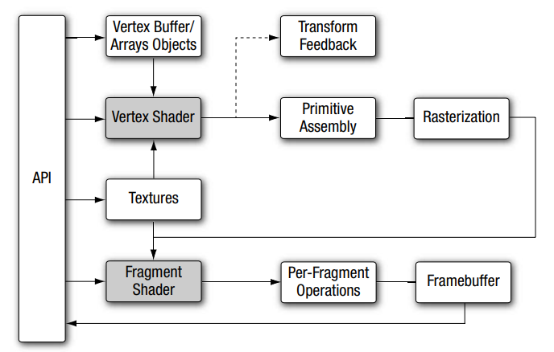
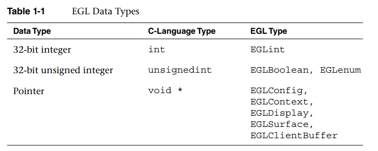

# OpenGL ES 3.0 in Android Development

## OpenGL 3.0 Graphic Pipeline

## GL vs EGL
> **GL (or OpenGL ES 3.0)** \
> GL refers to the actual rendering API (Application Programming Interface) used to render 2D and 3D graphics. It provides functions to create and manipulate graphics content such as textures, shaders, buffers, and framebuffers.

**GL Data Types**
| Category               | Data Type      | Description                                                   |
|------------------------|----------------|---------------------------------------------------------------|
| Scalar Types           | GLbyte         | Signed 8-bit integer                                          |
|                        | GLubyte        | Unsigned 8-bit integer                                        |
|                        | GLshort        | Signed 16-bit integer                                         |
|                        | GLushort       | Unsigned 16-bit integer                                       |
|                        | GLint          | Signed 32-bit integer                                         |
|                        | GLuint         | Unsigned 32-bit integer                                       |
|                        | GLfixed        | 32-bit fixed-point value                                      |
|                        | GLfloat        | 32-bit floating-point value (single precision)                |
|                        | GLclampf       | Clamped floating-point value in the range [0, 1]              |
|                        | GLdouble       | 64-bit floating-point value (double precision)                |
|                        | GLclampd       | Clamped double-precision floating-point value in the range [0, 1] |
| Boolean Type           | GLboolean      | Boolean values (`GL_TRUE` or `GL_FALSE`)                      |
| Size and Pointer Types | GLsizei        | 32-bit integer size type                                      |
|                        | GLsizeiptr     | Pointer-sized integer type for buffer sizes                   |
|                        | GLintptr       | Pointer-sized integer type for buffer offsets                 |
| String and Enum Types  | GLchar         | Character type, used for strings (e.g., shader source code)   |
|                        | GLenum         | Enumerated type for symbolic constants                        |
| Specialized Types      | GLhalf         | 16-bit floating-point value (half precision)                  |
|                        | GLbitfield     | 32-bit bitfield for flag bits                                 |

> **EGL** \
> EGL is an interface between the graphics rendering APIs (like OpenGL ES 3.0) and the native windowing system. It handles context creation, surface management, and synchronization.
> 

**Note:** *All GL (or EGL) commands begin with the prefix gl (or egl) and use an initial capital letter for each word making up the command name.*

## OpenGL ES Shader Program
As in OpenGL, an OpenGL ES shader program is created by compiling individual shader source code strings and linking them together into a single program object. This program object defines the entire rendering pipeline and is used during rendering to execute the shaders.

| Function               | Parameters                                                                                                                                                                        | Description                                                                                                                                                                                                                       |
|------------------------|----------------------------------------------------------------------------------------------------------------------------------------------------------------------------------|-----------------------------------------------------------------------------------------------------------------------------------------------------------------------------------------------------------------------------------|
| `glCreateShader`       | `GLenum type`: The type of shader to create (`GL_VERTEX_SHADER` or `GL_FRAGMENT_SHADER`).                                                                                     | Creates a new shader object. Takes a shader type (`GL_VERTEX_SHADER` or `GL_FRAGMENT_SHADER`) as an argument and returns a handle to the new shader object.                                                                        |
| `glDeleteShader`       | `GLuint shader`: Handle to the shader object to delete.                                                                                                                       | Deletes a shader object. Takes a handle to the shader object to delete. If the shader is attached to a program object, it will be marked for deletion and deleted once detached.                                                   |
| `glShaderSource`       | `GLuint shader`: Handle to the shader object. `GLsizei count`: Number of shader source strings. `const GLchar* const* string`: Pointer to an array of strings holding the shader source code. `const GLint* length`: Pointer to an array of lengths of each string. If NULL, the strings are assumed to be null-terminated.  | Sets the source code in a shader. Takes a shader handle, the number of strings in the array, a pointer to an array of source code strings, and an array of string lengths.                                                          |
| `glCompileShader`      | `GLuint shader`: Handle to the shader object to compile.                                                                                                                      | Compiles the source code of a shader object. Takes a handle to the shader object to compile.                                                                                                                                       |
| `glGetShaderiv`        | `GLuint shader`: Handle to the shader object to get information about. `GLenum pname`: The parameter to get (e.g., `GL_COMPILE_STATUS`, `GL_INFO_LOG_LENGTH`). `GLint* params`: Pointer to an integer to store the result.  | Returns a parameter from a shader object. Takes a shader handle, a parameter name (e.g., `GL_COMPILE_STATUS`, `GL_INFO_LOG_LENGTH`), and a pointer to store the result.   Some parameter names:   `GL_COMPILE_STATUS`: Returns the compilation status of the shader.   `GL_INFO_LOG_LENGTH`: Returns the length of the info log.   `GL_SHADER_SOURCE_LENGTH`: Returns the length of the shader source code.   `GL_SHADER_TYPE`: Returns the type of the shader (`GL_VERTEX_SHADER` or `GL_FRAGMENT_SHADER`).   `GL_DELETE_STATUS`: Returns whether the shader has been marked for deletion.                                 |
| `glGetShaderInfoLog`   | `GLuint shader`: Handle to the shader object to get the info log from. `GLsizei maxLength`: Size of the buffer to store the info log. `GLsizei* length`: Pointer to an integer to store the length of the info log. `GLchar* infoLog`: Pointer to a character buffer to store the info log.  | Retrieves the info log for a shader object. Takes a shader handle, the maximum length of the info log, a pointer to store the length of the info log, and a buffer to store the log.                                                |

### Create and Link a Program Object
A program object in OpenGL is a container used to link together multiple shader objects to form an executable shader program. The primary purpose of the program object is to allow for the combination of various shaders (typically vertex and fragment shaders) into a complete rendering program that can be executed by the GPU.

| Function                        | Parameters                                                                                                                                                                | Description                                                                                                                |
|---------------------------------|--------------------------------------------------------------------------------------------------------------------------------------------------------------------------|----------------------------------------------------------------------------------------------------------------------------|
| `glCreateProgram`               | None                                                                                                                                                                     | Creates a new program object and returns a handle to it.                                                                   |
| `glDeleteProgram`               | `GLuint program`: Handle to the program object to delete.                                                                                                                 | Deletes the specified program object. If the program object is currently in use, it will be marked for deletion.           |
| `glAttachShader`                | `GLuint program`: Handle to the program object. `GLuint shader`: Handle to the shader object to attach to the program.                                                 | Attaches a shader object to a program object.                                                                              |
| `glDetachShader`                | `GLuint program`: Handle to the program object. `GLuint shader`: Handle to the shader object to detach from the program.                                               | Detaches a shader object from a program object.                                                                            |
| `glLinkProgram`                 | `GLuint program`: Handle to the program object to link.                                                                                                                   | Links all attached shaders to create an executable program.                                                                |
| `glGetProgramiv`                | `GLuint program`: Handle to the program object to get information about. `GLenum pname`: The parameter to get information about (e.g., `GL_LINK_STATUS`). `GLint *params`: Pointer to an integer to store the result. | Queries the link status or other parameters of the program object.                                                         |
| `glGetProgramInfoLog`           | `GLuint program`: Handle to the program object for which to get information. `GLsizei maxLength`: The size of the buffer to store the info log. `GLsizei *length`: Pointer to an integer to store the length of the info log written (excluding the null terminator). `GLchar *infoLog`: Pointer to the character buffer to store the info log. | Retrieves the information log for the specified program object.                                                            |
| `glValidateProgram`             | `GLuint program`: Handle to the program object to validate.                                                                                                               | Validates the program object against the current OpenGL state.                                                             |
| `glUseProgram`                  | `GLuint program`: Handle to the program object to make active.                                                                                                            | Sets the specified program object as the current active program. This program will be used for rendering until another program is set as active. |

## Vertex Attributes, Vertex Arrays and Buffer Objects
Vertex data, also referred to as vertex attributes, specify per-vertex data. This per-vertex data can be specified for each vertex, or a constant value can be used for all vertices.

### Constant Vertex Attribute
#### Description
A constant vertex attribute is the same for all vertices of a primitive, so only one value needs to be specified for all the vertices of a primitive. This is achieved using various functions provided by OpenGL. The `glVertexAttrib*` commands are used to load the generic vertex attribute specified by index.

#### Functions
| Function           | Parameters                                | Description                                                  |
|--------------------|-------------------------------------------|--------------------------------------------------------------|
| `glVertexAttrib1f` | `index: GLuint`, `x: GLfloat`             | Set a single float value for the specified attribute index.  |
| `glVertexAttrib2f` | `index: GLuint`, `x: GLfloat`, `y: GLfloat` | Set two float values (x, y) for the specified attribute index. |
| `glVertexAttrib3f` | `index: GLuint`, `x: GLfloat`, `y: GLfloat`, `z: GLfloat` | Set three float values (x, y, z) for the specified attribute index. |
| `glVertexAttrib4f` | `index: GLuint`, `x: GLfloat`, `y: GLfloat`, `z: GLfloat`, `w: GLfloat` | Set four float values (x, y, z, w) for the specified attribute index. |
| `glVertexAttrib1fv`| `index: GLuint`, `values: const GLfloat*` | Set a single float value using an array for the specified attribute index. |
| `glVertexAttrib2fv`| `index: GLuint`, `values: const GLfloat*` | Set two float values (x, y) using an array for the specified attribute index. |
| `glVertexAttrib3fv`| `index: GLuint`, `values: const GLfloat*` | Set three float values (x, y, z) using an array for the specified attribute index. |
| `glVertexAttrib4fv`| `index: GLuint`, `values: const GLfloat*` | Set four float values (x, y, z, w) using an array for the specified attribute index. |

#### Note
- `glVertexAttriblf` and `glVertexAttriblfv` load `(x, 0.0, 0.0, 1.0)` into the generic vertex attribute.
- `glVertexAttrib2f` and `glVertexAttrib2fv` load `(x, y, 0.0, 1.0)` into the generic vertex attribute.
- `glVertexAttrib3f` and `glVertexAttrib3fv` load `(x, y, z, 1.0)` into the generic vertex attribute.
- `glVertexAttrib4f` and `glVertexAttrib4fv` load `(x, y, z, w)` into the generic vertex attribute.

In practice, constant vertex attributes provide equivalent functionality to using a scalar/vector uniform, and using either is an acceptable choice.

### Vertex Array
Vertex arrays are buffers stored in the application's address space (referred to as the client space in OpenGL ES) that specify attribute data per vertex. They serve as the foundation for vertex buffer objects (VBOs), providing an efficient and flexible way to specify vertex attribute data. Vertex arrays are set up using the glVertexAttribPointer or glVertexAttribIPointer function.

#### glVertexAttribPointer

| Parameter   | Description                                                                                         |
|-------------|-----------------------------------------------------------------------------------------------------|
| `index`     | Specifies the generic vertex attribute index.                                                      |
| `size`      | Number of components specified in the vertex array for the attribute.                               |
| `type`      | Data format of the attribute. Valid values include GL_BYTE, GL_UNSIGNED_BYTE, GL_SHORT, GL_UNSIGNED_SHORT, GL_INT, GL_UNSIGNED_INT, GL_HALF_FLOAT, GL_FLOAT, GL_FIXED, GL_INT_2_10_10_10_REV, and GL_UNSIGNED_INT_2_10_10_10_REV. |
| `normalized`| Indicates whether non-floating data should be normalized when converted to floating-point values.  |
| `stride`    | Specifies the delta between data for each vertex.                                                  |
| `ptr`       | Pointer to the buffer holding vertex attribute data.                                               |

#### glVertexAttribIPointer

| Parameter   | Description                                                                                         |
|-------------|-----------------------------------------------------------------------------------------------------|
| `index`     | Specifies the generic vertex attribute index.                                                      |
| `size`      | Number of components specified in the vertex array for the attribute.                               |
| `type`      | Data format of the attribute. Valid values include GL_BYTE, GL_UNSIGNED_BYTE, GL_SHORT, GL_UNSIGNED_SHORT, GL_INT, and GL_UNSIGNED_INT. |
| `stride`    | Specifies the delta between data for each vertex.                                                  |
| `ptr`       | Pointer to the buffer holding vertex attribute data.                                               |

## OpenGL Shading Language

